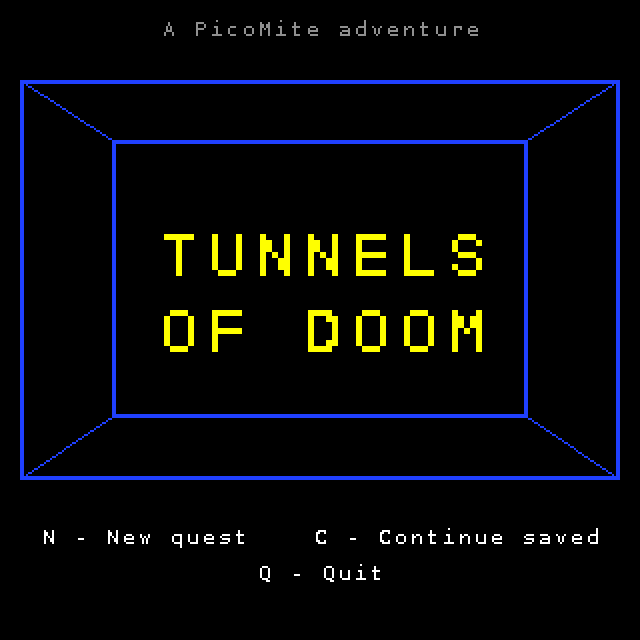
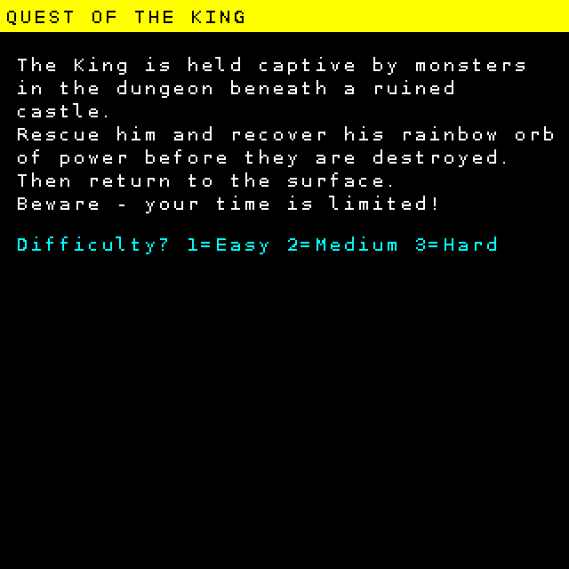
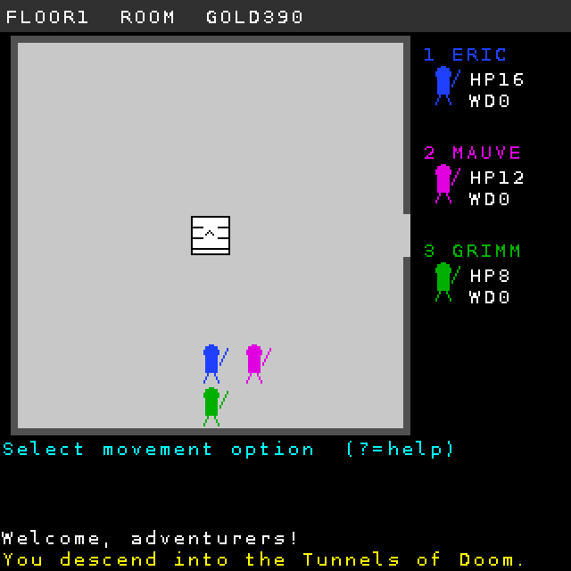
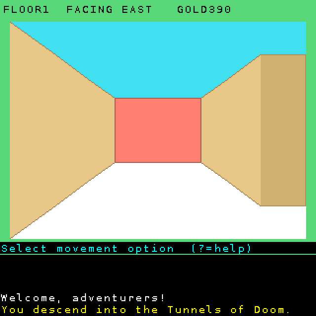
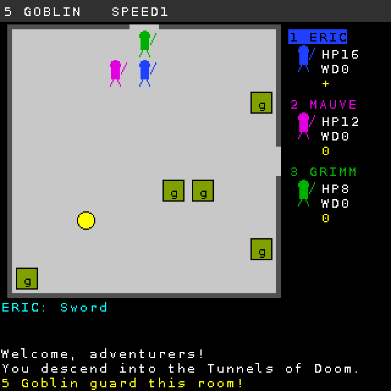

# Tunnels of Doom — PicoMite / PicoCalc edition

A much simplified port of Kevin Kenney's 1982 TI-99/4A dungeon adventure, written in PicoMite (MMBasic) BASIC for the PicoCalc and its 320×320 LCD.

| File           | Purpose                                                                       |
|----------------|-------------------------------------------------------------------------------|
| `TOD.BAS`      | The game                                                                      |
| `PARTY.BAS`    | The Party creator — writes `PARTY.DAT` (run first)                            |
| `QUEST.ADV`    | "Quest of the King", the classic adventure (4 floors, monsters, time limits)  |
| `MORIA.ADV`    | "Moria", a Tolkien themed adventure (6 floors, monsters, no time limits)      |
| `WIZARDRY.ADV` | "Wizardry", a Wizardry themed adventure (10 floors, monsters, no time limits) |
| `ADVEDIT.BAS`  | Adventure editor — edit `.ADV` modules on the PicoCalc                        |
| `PENNIES.ADV`  | "Pennies and Prizes", a gentle adventure (no monsters)                        |
| `screens/`     | Screenshots rendered from the game's drawing commands                         |

---

## 1. Introduction

Tunnels of Doom is a party-based dungeon crawl. You lead up to four adventurers down through multi-level dungeons, exploring hallways in a first-person view and fighting in an overhead room view. Your goal is set by the adventure module you load: in *Quest of the King* you must rescue the King and recover his Rainbow Orb before time runs out, then return to the surface.



The game features:

- **Hallways** drawn in 3D perspective, where wandering monsters may ambush you.
- **Rooms** holding monsters, gold, equipment, magic items and floor maps (for some adventures these are required to descend a floor).
- **Treasure chests** (sometimes trapped) and **vaults** that open with a three-digit combination.
- **Fountains** whose water may heal, strengthen, curse or poison the drinker.
- **Living statues** that will identify an unknown magic item for a price — or crush it.
- **General stores** on the surface and on selected floors.

The game is written in 1,600 lines, so many things are simplified. Graphics are drawn with simple shapes and sound effects are simple tones; the map, combat arena and screens are laid out for a 320×320 display. 
Adventures are loaded from plain text files, so you can write your own. The original game supported a high degree of customisation and an advanced adventure editor, which was not possible in this simplified version.

## 2. Playing the game

### 2.1 Create a party

Run `PARTY.BAS`.

1. Choose the number of players (1–4).
2. For each player enter a name (up to 10 letters), a class and a colour.
3. The party screen shows each player's rolled **hit points (HP)** and **bonus**. Press **R** to re-roll everyone, **ENTER** to save, or **ESC** to start over.
4. `PARTY.DAT` is written. Press **ENTER** to launch the game straight away.

| Class | Weapons | Armor | Special |
|---|---|---|---|
| Fighter | all | all | most hit points |
| Wizard | few | none | the only class (with Hero) that can read scrolls; starts with a Fireball Scroll |
| Rogue | all | light | much less likely to set off chest traps (Heroes share this) |
| Hero | all | all | does everything, but only allowed in a one-player party |

Exactly what each class may use is decided by the adventure ADV module, so other modules can change this. For example, in some role playing games Wizards cannot use swords whereas Gandalf wielded the elven sword Glamdring. So in *Moria* the Wizard class can use swords.

The same `PARTY.DAT` can be reused for as many games as you like. Party members always start a new quest at level 1.

### 2.2 Start a quest

Run `TOD.BAS`. On the title screen:

- **N** — new quest: pick a module from the list of `.ADV` files, read the introduction, then choose difficulty 1 (easy) to 3 (hard). Harder games give less starting gold and larger monster groups.
- **C** — continue the saved game.
- **Q** — quit.



You begin at the **general store**. Press a player number (1–4) to choose a buyer, then a letter to buy an item. Once a buyer is chosen, the list is colour-coded for that player: yellow for items they can use, grey for ones their class cannot (and ammunition for a weapon they may not carry), with a `*` after the name of anything they already have (ammunition only if a matching weapon has some loaded; rations are shared by the party and never marked). Weapons, armor, ammunition, rations and healing are all for sale. A player carries two weapons at most: if both hands are full, the game lists them ("1 Sword   2 Short Bow (20)") and asks which to replace, and **ESC** keeps both (your gold is not spent). **ESC** leaves the store and you descend into the dungeon.

### 2.3 Moving around

There are two views.

**Room view** (overhead). The arrow keys move the party straight out through an exit on that side.



**Hallway view** (first person). Openings in the walls lead to more hallway; wooden doors, on the side walls or straight ahead, lead into rooms. **UP** walks forward, **LEFT/RIGHT** turn, **DOWN** turns around. The top bar shows which way you are facing.



| Key | Action |
|---|---|
| Arrows | move / turn |
| `>` or `.` | go down stairs (in the stairs-down room) |
| `<` or `,` | go up stairs (in the stairs-up room) |
| `M` | show the floor map |
| `1` | player report (use UP/DOWN to page through players) |
| `2` | party report (gold, rations, steps, quest items) |
| `U` | use a magic item |
| `T` | trade or drop a magic item |
| `O` | change formation (choose who leads) |
| `L` | listen at a room door from the hallway |
| `K` | save the game (only in a hallway, not in a room) |
| `Q` | abandon the quest |
| `?` or `H` | command summary |

The map shows every place you have visited. Finding a floor's **map** (hidden in one of its rooms) reveals the whole floor, and in *Quest of the King* you cannot descend until you have found the map of your current floor.

### 2.4 Rooms and treasure

Entering a room triggers whatever is inside:

- **Monsters** attack first (see Combat). Defeat them to claim the room's contents.
- **Gold, items, maps and quest objects** are picked up automatically; you choose who carries an item.
- **Chest** — choose who opens it. It may be trapped.
- **Vault** — choose who opens it and guess the three-digit combination. Each digit runs from 1 to a maximum that rises on deeper floors. After each guess you are told how many digits are in the right place and whether the real combination is **higher** or **lower**. Each wrong guess may burn the opener. ESC gives up (the combination changes next time).
- **Fountain** — each player may drink once per visit, with random good or bad effects.
- **Living statue** — offer gold (10–90) to have a magic item identified. Offer too little and it may be destroyed.
- **Store** — found on the floors the module chooses.

### 2.5 Combat



Players act in order; the current player's name is highlighted in the side panel. Each player may **take one step and then attack**, or just attack.

| Key | Action |
|---|---|
| Arrow | step, or attack a monster in that direction |
| `F` | fire a ranged weapon — aim with the arrow keys, **SPACE** fires |
| `W` | switch between your two weapons (uses an action) |
| `N` | negotiate — the monsters name a price; **Y** pays, **N** haggles (halves the price but risks them attacking), **R** refuses |
| `U` | use a magic item |
| `1` `2` `3` | player, party and monster reports |
| `ENTER` / `SPACE` | end this player's turn |

The side panel shows each player's **HP** (maximum hit points) and **WD** (wounds taken). A player whose wounds reach their hit points is disabled. Under each player, the indicator `++`, `+`, `0`, `-`, `--` shows how that player's fighting chances compare with the monster's — `++` is very favourable, `--` very poor.

Monsters with **speed** 2 move twice per turn. Some monsters use ranged attacks. Defeated monsters give experience; players gain a level (and extra hit points) as experience grows.

### 2.6 Staying alive

- **Rations**: every 10 steps the party eats one ration and each wounded player heals one wound. With no rations you do not heal.
- **Healing** (bought in the store): heals one wound per step until used up.
- **Magic items** are unidentified until used, bought or identified by a statue. Some are harmful: cursed potions, poison ale.
- **Time limits**: some quest objects are destroyed if not found in time. The countdown drops by one turn every 10 steps; if it reaches zero the quest fails. The party report (**2**) shows the turns left for each object (in red at 10 or fewer) and how many steps remain until the next turn. Countdowns are kept in saved games.

To **win**, find every quest object and climb the up-stairs on floor 1. Climbing out before then simply returns you to the surface store.

### 2.7 Saving and continuing

Press **K** in a **hallway** to save to `TODSAVE.DAT`. Saving is not allowed inside a room: a room's monsters stand where they were placed when you entered, and that is not recorded in the save, so a game saved in a guarded room would reload with the monsters moved and healed. Step out into the hallway first. There is one save slot; saving again overwrites it. Choose **C** on the title screen to continue. The save holds the whole dungeon (every room, what you have seen, maps found), the party with all equipment, gold, rations, steps, quest progress and time limits, and which magic items you have identified. The save records which module it belongs to, so keep that `.ADV` file on the card.

---

## 3. Writing adventure modules

A module is a plain text file with the extension `.ADV`. Put it next to `TOD.BAS` and it appears in the New Quest list (up to 9 modules are listed). `QUEST.ADV` is heavily commented and is the best starting point to copy.

### 3.0 Using the adventure editor

`ADVEDIT.BAS` edits modules on the PicoCalc itself. Run it, pick an `.ADV` file (or press **N** to start from a small working template), and use the main menu:

| Key | Action |
|---|---|
| `1`–`7` | open a section: story text, settings, items, starting kits, monsters, quest objects, floor maps |
| `8` | every line of the file, including comments, for raw editing |
| `V` | validate the module (see below) |
| `S` / `A` | save, or save as a new file (asks before replacing a file) |
| `L` / `Q` | load another file / quit (both warn about unsaved changes) |

In a section list: **ENTER** edits the highlighted line, **I** inserts a new one (pre-filled with sensible values), **C** copies it, **X** deletes it, **U**/**M** move it up/down, **ESC** goes back. Editing a monster or item shows each field with its name, e.g. *Hit points*, *Max floor*, *Cost 0=not sold*. Number fields only accept numbers (including `&H` colours), and commas are refused because they separate fields. Map rows keep their leading spaces.

The editor keeps the file as text lines, so your comments, blank lines and line order are saved exactly as they were. Files can hold up to 220 lines of up to 200 characters.

**Validate** checks what `TOD.BAS` would silently ignore or get wrong: unknown keywords, repeated settings, too few fields, non-numbers, item kinds, ranged weapons with no matching ammunition, kits naming items that don't exist, monster floor ranges and group sizes, quest floors, map rows that are too long or wider than the grid, maps without stairs, and the limits on counts.

### 3.1 File rules

- One entry per line: `KEYWORD,field,field,...`
- Lines starting with `#` (and blank lines) are ignored.
- Keywords are not case-sensitive. Spaces around fields are trimmed.
- Fields are separated by commas, so **text fields cannot contain commas**.
- Keep lines under 255 characters.
- Anything missing uses a default, and over-long values are cut to fit, so a mistake will not crash the game.

### 3.2 Story text

| Line | Meaning |
|---|---|
| `TITLE,text` | adventure name |
| `INTRO,text` | introduction paragraph, word-wrapped; up to 5 lines of 160 characters |
| `WIN,text` | victory message |
| `FAIL,text` | message when the party dies or a quest object is destroyed |

### 3.3 Dungeon settings

| Line | Meaning | Default |
|---|---|---|
| `FLOORS,n` | number of floors, 1–10 | 3 |
| `GRID,w,h` | cells per floor, up to 14×10 | 12,9 |
| `ROOMS,n` | rooms per randomly generated floor, 3–40 | 14 |
| `GOLD,e,m,h` | starting gold per player at difficulty 1, 2, 3 | 150,120,100 |
| `WANDER,n` | % chance per hallway step of a wandering monster | 5 |
| `NEEDMAP,0/1` | 1 = must find a floor's map before going down | 1 |
| `STORE,a,b` | floor numbers that contain a store (0 = none) | 4,8 |
| `SEED,n` | 0 = a new dungeon each game; any other number = the same dungeon every time | 0 |

### 3.4 Items

```
ITEM,kind,name,v1,v2,cost,classes,unknown-name
```

- **name**: up to 20 characters. **cost** 0 means it is not sold in stores (it can still be found).
- **classes**: letters `F` `W` `R` `H` for who may use it. Blank means everyone.
- **unknown-name**: what an unidentified magic item is called (e.g. `Potion`).

| Kind | Item | v1 | v2 |
|---|---|---|---|
| `W` | hand weapon | damage | — |
| `R` | ranged weapon | damage | ammo group number |
| `X` | ammunition | count per purchase | ammo group (must match its weapon) |
| `A` | armor | protection | — |
| `S` | shield | protection | — |
| `P` | rations | count | — |
| `H` | healing | wounds healed | — |
| `M` | magic | effect (below) | power |

Magic effects: `1` heal wounds (power = amount) · `2` cursed, harms the user · `3` fireball, damages every monster · `4` bolt, damages one chosen monster · `5` reveal this floor's map · `6` raise maximum HP · `7` raise bonus.

Up to 48 items. The store shows the first 17 items that have a cost.

### 3.5 Starting kit

```
KIT,classes,item name
```

Gives every player of the listed classes a free item at the start. `KIT,FR,Leather Armor` gives it to Fighters and Rogues. Repeat a line to give two (e.g. two packs of arrows). Up to 24 lines.

### 3.6 Monsters

```
MON,name,glyph,colour,hp,attack,defense,damage,speed,xp,minfloor,maxfloor,maxcount,ranged,negotiate%,sound
```

| Field | Meaning |
|---|---|
| name | up to 16 characters |
| glyph | one character drawn on the monster's tile |
| colour | tile colour as `&HRRGGBB` |
| hp | hit points of each monster |
| attack / defense | skill values; higher means more likely to hit / harder to hit |
| damage | maximum damage per hit |
| speed | moves per turn (1 or 2 is typical) |
| xp | experience for each one killed |
| minfloor / maxfloor | floors where it appears |
| maxcount | largest group, **1–7** (hard difficulty may add one, still capped at 7) |
| ranged | 1 = can attack from a distance |
| negotiate% | chance per round that they will bargain (0 = never) |
| sound | what you hear when listening at their door, e.g. `rattling bones` |

Up to 24 monsters. A module with no `MON` lines has no fighting at all (see `PENNIES.ADV`).

### 3.7 Quest objects

```
QUEST,name,floor,countdown
```

Each object is hidden in a room on the given floor, usually guarded by a slightly tougher monster. **countdown** is the time limit in ticks (one tick every 10 steps, counted from the start of the game); 0 means no limit. Up to 8 objects. The quest is won when all are found and the party climbs out on floor 1.

### 3.8 Hand-drawn floors

Any floor can be drawn by hand; the rest are generated. Start with `FLOOR,n`, then give each map row as a `MAP,` line:

```
FLOOR,1
MAP,U-+-+-+-R   R-+-+-C
MAP,  |     |   |     |
MAP,  +     +-+-+     +
```

- Text starts straight after `MAP,` — leading spaces count.
- Cells sit at **even character positions of even rows** (counting from 0).
- Between cells, `-` joins left and right neighbours. On the odd rows, `|` under a cell joins it to the cell below.

| Symbol | Cell |
|---|---|
| `+` | hallway |
| `R` | ordinary room (gets random monsters/treasure) |
| `U` | stairs up — **every floor needs one** |
| `D` | stairs down — needed on every floor except the last |
| `S` | store |
| `C` | chest room |
| `V` | vault room |
| `F` | fountain room |
| `T` | living statue room |

Hand-drawn floors keep exactly the features you draw. Monsters, gold, items, the floor map and quest objects are still placed at random in their rooms. Make sure every cell can be reached from the up-stairs.

### 3.9 Limits at a glance

10 floors · 14×10 grid · 48 items · 24 monsters · 7 monsters per group · 8 quest objects · 24 kit lines · 5 intro lines · 9 modules listed on the menu.

---

### 3.10 Editor roadmap

The editor is deliberately simple. Possible future features, roughly in order of usefulness:

1. **Graphical map editor** — move a cursor over the grid and place rooms, stairs and links, instead of typing map rows.
2. **Randomisers** — generate a monster, item, quest name or a whole floor map at random, with stats scaled to the floor.
3. **New-adventure wizard** — answer a few questions (floors, difficulty, theme) and get a complete, balanced module.
4. **Pick lists** — choose item kinds, classes and colours from menus rather than typing codes, with a colour preview for monsters.
5. **Balance report** — per floor: monsters available, average monster strength, gold and items on offer.
6. **Play-test button** — save and run `TOD.BAS` on the module directly.
7. **Search and bulk edit** — find a name across the file, or scale all monster hit points by a percentage.
8. **Undo** for the last change, and automatic backup (`.BAK`) on save.
9. **Larger files** — stream very long modules instead of holding every line in memory.

## 4. Developer's guide

### 4.1 Overview

`TOD.BAS` is a single program using `OPTION EXPLICIT` and `OPTION DEFAULT INTEGER` (the map packing relies on 64-bit integers). Arrays are indexed from 0 (the MMBasic default). The main loop is simply:

```
DO
  TitleScr      ' new game or load
  PlayGame      ' runs until over<>0, then shows EndScr
LOOP
```

### 4.2 Code map

The source is split into commented sections, in this order:

| Section | Main routines |
|---|---|
| Declarations | constants, module tables, party arrays, game state, combat state |
| Graphics wrappers | `Clr` `Tx` `TxA` `Bx` `Bo` `Ln` `Ci` `Tr` `GetK` |
| Text helpers | `FS$` `NF` `Rest$` (CSV fields), `Msg` / `DrawLog` (5-line message log), `Prompt`, `TopBar`, `RL` (report line), `WrapTx` |
| Cell access | `CG` (get bits), `CS` (set bits), `KDir` |
| Module & party loading | `LoadModule`, `LoadParty`, `ApplyKits`, `FindItem` |
| Dungeon generation | `BuildDungeon` → per floor `GenFloor` (or `ParseMap` for drawn floors), `Carve`, `Link`, `Populate`, `PlaceSpecial`; `PickMon`, `MonCount`, `PickItem` |
| Items & party | `GiveItem`, `PickMI`, `UseMagic`, `IName$`, `Info$`, `Alive`, `PartyAlive`, `AllFound`, `Wound`, `Prot`, `AskP`, `GainXP`, `SwapP` |
| Drawing | `DrawFig`, `DrawMon`, `DrawHall` (perspective corridor, with `ExitKind`, `SideDoor` and `FrontDoor` for doors into rooms), `DrawArena`, `Panel`, `DrawRoomScr`, `Redraw`, `ShowMapScr` |
| Reports | `PlayerRpt`, `PartyRpt`, `MonRpt`, `HelpScr`, `Ind$`, `WName$`, `Store` |
| Exploration | `PlayGame` (key loop), `Walk`, `MoveTo`, `TakeStep`, `TimeStep`, `Stairs`, `Listen`, `Trade`, `Formation` |
| Rooms | `RoomEvents`, `Treasure`, `Reveal`, `Vault`, `Fountain`, `Statue` |
| Combat | `SetupFight` (places monsters and party as the room is entered, before it is drawn), `Placed`, `Combat`, `DrawCombat`, `PTurn`, `Attack`, `DmgMon`, `Target`, `MTurn`, `MAttack`, `Negot`, `Occ`, `PlaceMon`, `SetSlots`, `PHit`, `MHit` |
| Save / load | `AddN`, `SaveGame`, `LoadGame` |
| Title & end | `TitleScr`, `NewGame`, `EndScr` |

### 4.3 The map cell

Each floor is `cell(floor, x, y)`, one 64-bit integer per grid cell with all its data packed into bit fields. `LoadModule` sizes the array to exactly the module's `FLOORS` and `GRID` (`ERASE cell` then `DIM cell(nfl,gw-1,gh-1)`), so loop over `gw-1`/`gh-1`, never fixed sizes. Always use `CG(x,y,shift,bits)` and `CS x,y,shift,bits,value`; both act on the current floor `fl`.

| Constant | Bit | Width | Holds |
|---|---|---|---|
| `BMK` | 0 | 4 | exits: bit 0 N, 1 E, 2 S, 3 W |
| `BTY` | 4 | 2 | 0 rock, 1 hallway, 2 room |
| `BFE` | 6 | 4 | feature: 1 chest, 2 vault, 3 fountain, 4 statue, 6 down, 7 up, 8 store |
| `BMO` | 10 | 5 | monster type (0 = none) |
| `BMC` | 15 | 3 | monster count (max 7) |
| `BSE` | 18 | 1 | seen by the party |
| `BQS` | 19 | 4 | quest object number |
| `BIM` | 23 | 8 | item number |
| `BGD` | 31 | 10 | gold ÷ 10 |
| `BMP` | 41 | 1 | this floor's map is here |

Directions are 0=N, 1=E, 2=S, 3=W with offsets in `DX()`/`DY()`. `Link x,y,d` opens a two-way exit between neighbouring cells. Stair positions are kept in `upx()/upy()/dnx()/dny()` per floor.

Hand-drawn `MAP` rows are not kept in memory. `LoadModule` only counts them per floor (`fmn()`); `ParseMap` reads them back from the module file while that floor is being built, so the `.ADV` file must stay on the card (it is needed anyway to continue a saved game).

**Memory**: MMBasic allocates variable memory in 256-byte pages, so every array or string costs at least 256 bytes. With *Quest of the King* loaded the game uses about 28 KB of variable memory (25 KB for *Pennies and Prizes*). Merging the many small arrays into a few tables would save a further 6–8 KB if it is ever needed.

### 4.4 Game state

- **Position**: `fl`, `px`, `py`, `pd` (facing), `inrm` (1 = room view), `ent` (side entered from).
- **Progress**: `steps`, `gold`, `rat` (rations), `dif`, `mapf()` (maps found), `qs()` (0 hidden, 1 found, 2 destroyed), `qt()` (countdowns), `ident()` (magic items identified).
- **Party** (index 1–`np`): `pn$ pcl pco php pwd pxp plv pbn pcw par psh phl`, weapons `pw(i,0..1)` with ammo `pam(i,0..1)`, magic items `pmi(i,0..9)`.
- **Ending**: `over` = 0 playing, 1 party dead, 2 quest failed, 3 abandoned, 4 won (`won`=1).
- **Combat**: monster type `cmt`, count `nmc`, positions `cmx/cmy`, hit points `chp`; player positions `cpx/cpy`.

### 4.5 Screen layout (320×320, FONT 1 = 8×12)

| Area | Position |
|---|---|
| Top bar | y 0–17 |
| Arena / hallway | 9×9 tiles of 24 px from (10, 24) |
| Side panel | x 236–319, 55 px per player |
| Prompt | y 245–256 |
| Message log | 5 lines, y 258–319, 40 characters each |

**Partial redraws.** The game keeps track of what is on screen (`scrv`: room, combat or hallway, plus which room and a signature from `ScrSig`). `Clr` marks the screen unknown, so any full-screen report or menu forces a complete redraw afterwards. Otherwise:

- `Redraw` (called after every key while exploring) repaints the room or hallway only if something it shows has changed; bumping a wall or pressing an unused key redraws nothing.
- In combat, `CombatView` draws everything only when needed. After that, a move repaints just the two tiles involved (`DrawTile`, which draws the floor, any room object from `DrawObj`, then whoever stands there). A killed monster or disabled player repaints one tile, and the aiming cursor repaints one tile per step. The side panel (`PanelIf`/`PanSig`) and top bar are repainted only when their contents change, and the log is drawn by `Msg`.

A typical combat keypress now paints about 7,000 pixels instead of clearing and repainting the whole 320×320 screen. The test harness checks this by redrawing each view in full at every keypress and comparing the two images pixel by pixel.

All drawing goes through the eight wrappers, so moving to another display size or font means changing the wrappers and the layout constants `TS`, `OX`, `OY`, `PANX` (and checking text widths).

### 4.6 Sound

All sound uses PicoMite's `PLAY TONE left,right,ms`, with the same frequency on both channels. Each program has two routines:

- `SndT freq,ms` starts a tone and then `PAUSE`s for its length, because a new `PLAY TONE` replaces one that is still playing. A frequency of 0 is a rest.
- `SndSeq notes$` plays a list such as `"523/100,0/50,880/40"` (frequency in Hz `/` duration in ms).

In `TOD.BAS`, game code only calls `Sfx "name"` (e.g. `Sfx "gold"`); all the effects' notes are in the one `SELECT CASE` inside `Sfx`, so sounds can be retuned in one place. The title screen plays the opening of the Swan theme from Tchaikovsky's *Swan Lake* (public domain) from `TitleTune`, which checks the keyboard while each note sounds; pressing **N**, **C** or **Q** stops it at once (`PLAY STOP`) and acts as that choice. Change its tempo with `CONST TBEAT` (milliseconds per quarter note). Sound is always on. `PLAY STOP` is called at the end-of-game screen and before `PARTY.BAS` runs the game. Effects play while the game waits, so keep new ones short.

### 4.7 File formats

**PARTY.DAT** (written by `PARTY.BAS`):
```
TODPARTY1
<number of players>
name,class,colour,hp,bonus      (one line per player; class 1-4, colour 1-4)
```

**TODSAVE.DAT** — comma-separated lines, each ending in a trailing comma:
1. `TODSAVE1,<module file>`
2. `fl,px,py,pd,inrm,ent,steps,gold,rat,dif,np`
3. one line per player: name, 11 stats, two weapon/ammo pairs, 10 magic items
4. `qt,qs` pairs for all 8 quest slots
5. `ident` flags for all 48 items
6. for each floor: `mapf,upx,upy,dnx,dny`, then one line per grid row holding the packed cell values

On loading, the module is read first (for item and monster tables), then the saved state overwrites everything else. If you add a new piece of game state, add it to both `SaveGame` and `LoadGame` and change the `TODSAVE1` header so old saves are refused.
